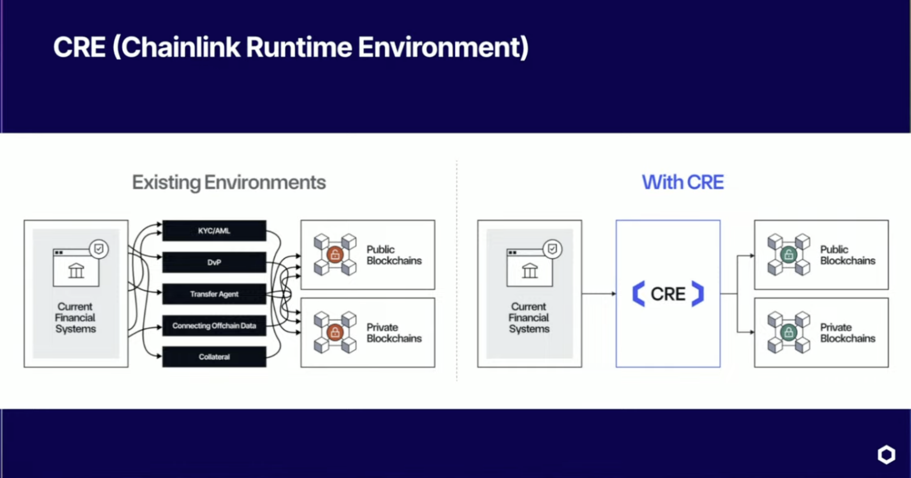

# CRE -- Chainlink Runtime Environment

**Blockchain-verified financial operations for the BUFI platform.**



## The Problem: A Messy Middle

Look at the left side of that diagram. That is us today.

Our financial system -- Shiva, Motora, Trigger.dev, Circle, Bridge, Alfred, Rain, Stripe -- talks to blockchains through a tangle of individual integrations. Every service has its own connection to every chain. KYC/AML checks happen in one place, transfer execution in another, fee reconciliation in a third. Each path is a separate piece of infrastructure we built, maintain, and trust independently.

There is no unified verification layer. When Shiva executes a Circle transfer, we trust Circle's response. When Motora processes an Alfred ramp, we trust Alfred's webhook. When Trigger.dev runs a payroll batch, we trust our own code to get the math right. If something goes wrong between any of these systems and the blockchain, we find out from a support ticket, not from a cryptographic proof.

## The Solution: CRE as the Orchestration Layer

Now look at the right side.

CRE replaces the messy middle with a single orchestration layer. Our existing financial systems connect to CRE, and CRE connects to blockchains -- public and private. Every operation passes through a Decentralized Oracle Network (DON) where multiple independent nodes execute the same task, reach consensus, and produce a cryptographically signed result.

This means:

- **Every API call is consensus-verified.** When a CRE workflow calls Shiva to check a transfer, multiple independent Chainlink nodes call Shiva and must agree on the response. No single point of trust.
- **Every blockchain read is independently confirmed.** When CRE reads a USDC balance, multiple nodes read the chain independently. You get one verified answer.
- **Every write is cryptographically signed.** When CRE publishes an attestation on-chain, it carries a BFT consensus signature. The smart contract can verify it came from the DON, not from a single server.

We do not have to rewrite Shiva, Motora, or any of our services. CRE wraps around them. It calls their APIs, verifies the results through consensus, and produces provable, on-chain records of what happened.

---

## How It Works in This Repo

This package provides two things:

1. **`apps/cre/`** -- CRE workflows that run on Chainlink DONs, calling our platform APIs and writing verified results on-chain.
2. **`packages/cre/` (`@bu/cre`)** -- A client library that lets existing platform code (Trigger.dev tasks, Shiva routes, Motora handlers) trigger CRE workflows with a single function call.

```
apps/cre/
├── shared/                    # Reusable patterns -- the toolkit
│   ├── create-workflow.ts     # createWorkflow() -- eliminates all boilerplate
│   ├── triggers.ts            # withCron(), withHttp(), withLog()
│   ├── clients/               # Consensus-verified HTTP clients
│   │   ├── create-client.ts   # createPlatformClient() -- works with any API
│   │   └── presets.ts         # shivaClient(), motoraClient(), supabaseClient(), aceClient()
│   ├── services/              # On-chain operations
│   │   ├── attestation.ts     # publishAttestation() -- one call, on-chain proof
│   │   └── evm.ts             # resolveEvmClient(), callView() -- contract reads
│   ├── utils/                 # Encoding, secrets
│   └── abi/                   # TypeScript ABI definitions (ERC20, USDCg, Vault, TreasuryManager, etc.)
├── contracts/                 # Foundry -- BUAttestation.sol, USDCg.sol, TreasuryManager.sol
├── workflow-private-transfer/ # Ghost Mode: vault monitoring + proof-of-reserves
├── workflow-treasury-rebalance/ # USDCg buffer/yield ratio monitoring
├── workflow-invoice-settle/   # Invoice payment attestation
├── workflow-payroll-attest/   # Payroll batch attestation
├── workflow-report-verify/    # AI report hash attestation
├── workflow-example/          # Skeleton to copy from
└── scripts/                   # simulate, deploy, scaffold
```

---

## Guide 1: Connecting Existing HTTP Flows

This is the most common use case. We already have Shiva processing transfers, Motora handling ramps, Trigger.dev running payroll. We want to add blockchain verification without changing any of those services.

### Step 1: Create a workflow that calls your existing API

```bash
./scripts/new-workflow.sh workflow-transfer-verify
cd workflow-transfer-verify
bun install
```

### Step 2: Define what data you need from your API

Edit `types.ts` to describe the config. The config tells CRE where your API lives and what chain to write attestations to:

```typescript
// workflow-transfer-verify/types.ts
import { z } from "zod"

export const configSchema = z.object({
  // Which API to call
  shivaApiUrl: z.string().url(),

  // Where to write the attestation on-chain
  chainSelectorName: z.string(),
  attestationContract: z.string().regex(/^0x[a-fA-F0-9]{40}$/u),
  gasLimit: z.string(),
})

export type Config = z.infer<typeof configSchema>
```

### Step 3: Write your handler -- compose from shared primitives

Edit `handlers.ts`. The pattern is always the same: fetch from platform, verify, attest on-chain.

```typescript
// workflow-transfer-verify/handlers.ts
import { withHttp } from "../shared/triggers"
import { shivaClient } from "../shared/clients/presets"
import { publishAttestation } from "../shared/services/attestation"
import type { Config } from "./types"

const shiva = shivaClient<Config>()

export const initWorkflow = (config: Config) => [
  withHttp<Config>((runtime, payload) => {
    // payload contains the data sent by your platform code
    const body = JSON.parse(new TextDecoder().decode(payload.body))
    const transferId = body.transferId

    // 1. Fetch the transfer record from Shiva (consensus-verified)
    const transfer = shiva.get(
      runtime,
      `/transfers/${transferId}`,
      JSON.parse
    )

    runtime.log(`Verifying transfer ${transfer.id}: ${transfer.amount} USDC`)

    // 2. Publish a verified attestation on-chain
    const result = publishAttestation(runtime, {
      type: "transfer_verify",
      entityId: transfer.id,
      data: {
        amount: transfer.amount,
        from: transfer.fromAddress,
        to: transfer.toAddress,
        txHash: transfer.txHash,
      },
    })

    runtime.log(`Attestation published: ${result.txHash}`)
    return "Transfer verified"
  })(config),
]
```

### Step 4: Wire it up (3 lines)

```typescript
// workflow-transfer-verify/main.ts
import { createWorkflow } from "../shared/create-workflow"
import { configSchema } from "./types"
import { initWorkflow } from "./handlers"

export const main = createWorkflow({ configSchema, init: initWorkflow })
```

### Step 5: Test it

```bash
cre workflow simulate workflow-transfer-verify --target local-simulation
```

### Step 6: Embed it in existing platform code

Back in your existing services, trigger the CRE workflow with one import:

```typescript
// In a Trigger.dev task (e.g., tasks/fees/retry-fee-collection.ts)
import { triggerTransferVerification } from "@bu/cre"

// After the transfer succeeds, trigger blockchain verification:
await triggerTransferVerification({
  transferId: transfer.id,
  txHash: result.transactionHash,
  chainId: transfer.fromChainId,
  amount: transfer.amount,
})
```

```typescript
// In a Shiva route (e.g., routes/invoices.ts)
import { triggerInvoiceSettlement } from "@bu/cre"

// After invoice is marked paid:
await triggerInvoiceSettlement({
  invoiceId: invoice.id,
  paymentTxHash: payment.txHash,
  amount: invoice.total,
  currency: invoice.currency,
})
```

```typescript
// In a Motora webhook handler (e.g., routes/alfred/onramp.ts)
import { triggerRampVerification } from "@bu/cre"

// After ramp completes:
await triggerRampVerification({
  rampId: ramp.id,
  rampType: "onramp",
  expectedAmount: ramp.usdcAmount,
  depositAddress: ramp.depositAddress,
})
```

The CRE workflow runs on a Chainlink DON, calls back into your API through consensus, and writes an immutable attestation on-chain. Your existing code does not change -- it just adds one function call.

---

## Guide 2: Working with New Smart Contracts

When you need to deploy a new contract that CRE writes to, the flow involves Foundry for the contract and a CRE workflow that calls `writeReport()` to send consensus-signed data.

### The Contract Pattern: `onReport()`

CRE writes to contracts through a function called `onReport(bytes calldata report)`. The CRE forwarder calls this function with ABI-encoded data that was signed by the DON's consensus. Your contract decodes it and stores the data.

See `contracts/src/BUAttestation.sol` for the reference implementation:

```solidity
function onReport(bytes calldata report) external {
    (
        uint8 opType,
        string memory entityId,
        bytes32 dataHash,
        uint256 timestamp,
        string memory metadata
    ) = abi.decode(report, (uint8, string, bytes32, uint256, string));

    // Store the attestation, emit events, etc.
}
```

### Step 1: Write your contract

```bash
cd contracts
```

Create your Solidity contract in `src/`. It must have an `onReport(bytes calldata)` function that CRE's forwarder will call. The report contains whatever data your CRE workflow encoded.

```solidity
// contracts/src/MyConsumer.sol
// SPDX-License-Identifier: MIT
pragma solidity ^0.8.24;

contract MyConsumer {
    uint256 public lastPrice;
    uint256 public lastUpdated;

    event PriceUpdated(uint256 price, uint256 timestamp);

    function onReport(bytes calldata report) external {
        (uint256 price, uint256 timestamp) = abi.decode(report, (uint256, uint256));
        lastPrice = price;
        lastUpdated = timestamp;
        emit PriceUpdated(price, timestamp);
    }
}
```

### Step 2: Test and deploy with Foundry

```bash
# Build
forge build

# Test
forge test

# Deploy to Sepolia
forge create src/MyConsumer.sol:MyConsumer \
  --broadcast \
  --rpc-url $RPC_URL \
  --private-key $PRIVATE_KEY
```

Note the deployed contract address. You will put it in your workflow's `config.json`.

### Step 3: Add the ABI to your workflow

Create a TypeScript ABI definition in `shared/abi/`:

```typescript
// shared/abi/my-consumer.ts
export const MY_CONSUMER_ABI = [
  {
    type: "function",
    name: "onReport",
    stateMutability: "nonpayable",
    inputs: [{ name: "report", type: "bytes" }],
    outputs: [],
  },
  {
    type: "function",
    name: "lastPrice",
    stateMutability: "view",
    inputs: [],
    outputs: [{ name: "", type: "uint256" }],
  },
] as const
```

### Step 4: Create a workflow that writes to your contract

The key is `runtime.report()` to sign the data, then `evmClient.writeReport()` to submit it:

```typescript
// workflow-price-feed/handlers.ts
import { withCron } from "../shared/triggers"
import { resolveEvmClient } from "../shared/services/evm"
import type { Runtime } from "@chainlink/cre-sdk"
import { hexToBase64, bytesToHex } from "@chainlink/cre-sdk"
import { encodeAbiParameters, parseAbiParameters } from "viem"
import type { Config } from "./types"

export const initWorkflow = (config: Config) => [
  withCron<Config>((runtime) => {
    // 1. Get your data (from an API, computation, etc.)
    const price = fetchPrice(runtime) // your business logic
    const timestamp = Math.floor(Date.now() / 1000)

    // 2. ABI-encode the data for the contract
    const reportData = encodeAbiParameters(
      parseAbiParameters("uint256 price, uint256 timestamp"),
      [BigInt(price), BigInt(timestamp)]
    )

    // 3. Sign via CRE consensus (multiple nodes agree)
    const report = runtime.report({
      encodedPayload: hexToBase64(reportData),
      encoderName: "evm",
      signingAlgo: "ecdsa",
      hashingAlgo: "keccak256",
    }).result()

    // 4. Write to your contract on-chain
    const evmClient = resolveEvmClient(runtime.config)
    const result = evmClient.writeReport(runtime, {
      receiver: runtime.config.contractAddress,
      report,
      gasConfig: { gasLimit: runtime.config.gasLimit },
    }).result()

    const txHash = bytesToHex(result.txHash ?? new Uint8Array(32))
    runtime.log(`Price written on-chain: ${txHash}`)
    return txHash
  })(config),
]
```

### Step 5: Use `publishAttestation()` for the common case

If your contract follows the `BUAttestation.sol` pattern (and most verification workflows should), skip the manual encoding. The `publishAttestation()` helper does it all:

```typescript
import { publishAttestation } from "../shared/services/attestation"

const result = publishAttestation(runtime, {
  type: "balance_attest",
  entityId: `wallet-${address}`,
  data: { balance: onChainBalance, chain: "ethereum-testnet-sepolia" },
})
// That's it. Encoded, signed, written on-chain.
```

---

## Guide 3: Reading On-Chain Data

CRE can read from contracts using `callView()` -- a single function that handles encoding, calling, and decoding. Use this to verify on-chain state as part of any verification workflow.

```typescript
import { callView } from "../shared/services/evm"
import { ERC20_ABI } from "../shared/abi/erc20"
import type { Abi } from "viem"

// Read USDC balance of a wallet (one line)
const balance = callView(
  runtime,
  usdcContractAddress,
  ERC20_ABI as unknown as Abi,
  "balanceOf",
  [walletAddress],
)

// Read USDCg total supply (no args needed)
const totalSupply = callView(
  runtime,
  usdcgAddress,
  USDCG_ABI as unknown as Abi,
  "totalSupply",
)
```

`callView()` handles the entire encode → call → decode pipeline internally:
1. Encodes function data with `viem.encodeFunctionData()`
2. Calls the contract via CRE's `EVMClient.callContract()` (consensus-verified)
3. Decodes the result with `viem.decodeFunctionResult()`

All view calls return `bigint`. Use `formatUnits()` from viem when you need human-readable values.

> **IMPORTANT:** `callView()` uses `LATEST_BLOCK_NUMBER` internally, not `LAST_FINALIZED_BLOCK_NUMBER`. Free testnet RPCs (like Sepolia) lag behind on the `"finalized"` block tag -- recently deployed contracts return `0x` (empty data). Always use `LATEST_BLOCK_NUMBER` for testnets. If `callContract` returns empty data, verify with `curl` using both `"finalized"` and `"latest"` block tags to isolate the issue.

---

## Guide 4: Listening to On-Chain Events

Use `withLog()` to react to events emitted by smart contracts:

```typescript
import { withLog } from "../shared/triggers"
import { keccak256, toHex } from "viem"

const TRANSFER_EVENT_SIG = keccak256(toHex("Transfer(address,address,uint256)"))

export const initWorkflow = (config: Config) => [
  withLog<Config>(
    {
      getAddresses: (c) => [c.usdcContractAddress],
      getTopics: () => [TRANSFER_EVENT_SIG],
    },
    (runtime, log) => {
      // This fires whenever a USDC Transfer event is emitted
      // Decode the log, cross-reference with Shiva, publish attestation
      return "Transfer event processed"
    }
  )(config),
]
```

---

## Building Your Own Platform Client

The `createPlatformClient()` factory works with any HTTP API, not just the pre-configured presets. If you need to call a new service:

```typescript
import { createPlatformClient } from "../shared/clients/create-client"

// Create a client for any API
const myServiceClient = createPlatformClient<MyConfig>({
  secretId: "MY_SERVICE_API_KEY",       // Secret ID from secrets.yaml
  getBaseUrl: (config) => config.myServiceUrl,
  authType: "bearer",                    // or "api-key"
})

// Use it in a handler
const data = myServiceClient.get(runtime, "/endpoint", JSON.parse)
```

Every call goes through CRE consensus. Multiple DON nodes independently call the API and must agree on the response before it is accepted.

---

## Shared Primitives Reference

| Primitive | Purpose | Import From |
|-----------|---------|-------------|
| `createWorkflow()` | Eliminate CRE Runner boilerplate | `shared/create-workflow` |
| `withCron()` | Cron schedule trigger | `shared/triggers` |
| `withHttp()` | HTTP request trigger | `shared/triggers` |
| `withLog()` | EVM log event trigger | `shared/triggers` |
| `createPlatformClient()` | Consensus-verified HTTP client for any API | `shared/clients` |
| `shivaClient()` | Pre-configured Shiva client | `shared/clients` |
| `motoraClient()` | Pre-configured Motora client | `shared/clients` |
| `supabaseClient()` | Pre-configured Supabase REST client | `shared/clients` |
| `aceClient()` | Pre-configured ACE private transfer API client | `shared/clients` |
| `publishAttestation()` | One-call on-chain attestation | `shared/services` |
| `callView()` | Read any contract view function (encode+call+decode) | `shared/services` |
| `resolveEvmClient()` | Get EVMClient from chain name | `shared/services` |
| `resolveNetwork()` | Get network metadata from chain name | `shared/services` |
| `getRequiredSecret()` | Safe secret retrieval with errors | `shared/utils` |
| `toBase64()` / `jsonToBase64()` | Encoding for HTTP bodies | `shared/utils` |

---

## Real-World Example: USDCg Proof of Reserves

This is a complete, production workflow that runs on a Chainlink DON to verify USDCg is fully backed by USDC + yield. It demonstrates the canonical pattern: read on-chain state with `callView()`, compute derived values, publish an attestation.

### types.ts -- Define your config schema

```typescript
import { z } from "zod"

const hex40 = z.string().regex(/^0x[a-fA-F0-9]{40}$/u)

export const configSchema = z.object({
  chainSelectorName: z.string().min(1),
  attestationContract: hex40,
  gasLimit: z.string().regex(/^\d+$/u),

  // Contract addresses
  usdcgAddress: hex40,
  usdcAddress: hex40,
  treasuryManagerAddress: hex40,

  // Thresholds (basis points)
  bufferUpperBPS: z.string(),
  bufferLowerBPS: z.string(),
  bufferTargetBPS: z.string(),
})

export type Config = z.infer<typeof configSchema>
```

### handlers.ts -- Compose from shared primitives

```typescript
import { type Runtime } from "@chainlink/cre-sdk"
import { formatUnits, type Abi } from "viem"
import { withCron } from "../shared/triggers"
import { publishAttestation } from "../shared/services/attestation"
import { callView } from "../shared/services/evm"
import { TREASURY_MANAGER_ABI } from "../shared/abi/treasury-manager"
import { USDCG_ABI } from "../shared/abi/usdcg"
import { ERC20_ABI } from "../shared/abi/erc20"
import type { Config } from "./types"

const treasuryRebalanceCheck = withCron<Config>(
  (runtime) => {
    // 1. Read on-chain state (each call is consensus-verified)
    const bufferRatioBPS = callView(
      runtime,
      runtime.config.treasuryManagerAddress,
      TREASURY_MANAGER_ABI as unknown as Abi,
      "getBufferRatioBPS",
    )

    const usdcBuffer = callView(
      runtime,
      runtime.config.usdcAddress,
      ERC20_ABI as unknown as Abi,
      "balanceOf",
      [runtime.config.usdcgAddress],
    )

    const yieldValue = callView(
      runtime,
      runtime.config.treasuryManagerAddress,
      TREASURY_MANAGER_ABI as unknown as Abi,
      "getYieldValueUSDC",
    )

    const totalSupply = callView(
      runtime,
      runtime.config.usdcgAddress,
      USDCG_ABI as unknown as Abi,
      "totalSupply",
    )

    // 2. Compute derived values
    const totalBacking = usdcBuffer + yieldValue
    const upperBPS = BigInt(runtime.config.bufferUpperBPS)
    const lowerBPS = BigInt(runtime.config.bufferLowerBPS)
    const targetBPS = BigInt(runtime.config.bufferTargetBPS)

    // 3. Determine action
    let action = "hold"
    let actionAmount = 0n

    if (bufferRatioBPS > upperBPS && totalSupply > 0n) {
      action = "allocate_to_yield"
      const targetBuffer = (totalSupply * targetBPS) / 10000n
      actionAmount = usdcBuffer > targetBuffer ? usdcBuffer - targetBuffer : 0n
    } else if (bufferRatioBPS < lowerBPS && totalSupply > 0n) {
      action = "redeem_from_yield"
      const targetBuffer = (totalSupply * targetBPS) / 10000n
      actionAmount = targetBuffer > usdcBuffer ? targetBuffer - usdcBuffer : 0n
    }

    // 4. Publish attestation on-chain (one call)
    const result = publishAttestation(runtime, {
      type: "balance_attest",
      entityId: `rebalance-${Math.floor(Date.now() / 1000)}`,
      data: {
        bufferRatioBPS: bufferRatioBPS.toString(),
        usdcBuffer: usdcBuffer.toString(),
        yieldValue: yieldValue.toString(),
        totalBacking: totalBacking.toString(),
        totalSupply: totalSupply.toString(),
        action,
        actionAmount: actionAmount.toString(),
      },
    })

    return `Treasury: buffer=${bufferRatioBPS}BPS action=${action} tx=${result.txHash}`
  }
)

export const initWorkflow = (config: Config) => [
  treasuryRebalanceCheck(config),
]
```

### main.ts -- Wire it up (3 lines)

```typescript
import { createWorkflow } from "../shared/create-workflow"
import { configSchema } from "./types"
import { initWorkflow } from "./handlers"

export const main = createWorkflow({ configSchema, init: initWorkflow })
```

### The Pattern

Every workflow follows this exact structure:

1. **`types.ts`** -- Zod schema for config (contract addresses, chain, thresholds)
2. **`handlers.ts`** -- Business logic composed from shared primitives:
   - `callView()` for on-chain reads
   - `publishAttestation()` for on-chain writes
   - `withCron()` / `withHttp()` / `withLog()` for triggers
   - Platform clients (`shivaClient()`, `aceClient()`, etc.) for off-chain API calls
3. **`main.ts`** -- 3-line entry point using `createWorkflow()`
4. **`config.json`** -- Runtime values (addresses, URLs, schedules)
5. **`workflow.yaml`** -- CRE deployment targets

**Never duplicate the encode→call→decode pattern.** Use `callView()` from `shared/services/evm.ts`. Never duplicate attestation encoding. Use `publishAttestation()` from `shared/services/attestation.ts`.

---

## Creating a New Workflow

```bash
# Scaffold
./scripts/new-workflow.sh workflow-my-feature

# Edit
cd workflow-my-feature
#   types.ts    -- config schema (Zod)
#   handlers.ts -- business logic (compose from shared/)
#   config.json -- runtime values

# Install
bun install

# Run
cre workflow simulate workflow-my-feature --target local-simulation
```

## Commands

```bash
./scripts/simulate.sh --list                              # List all workflows
./scripts/simulate.sh workflow-example local-simulation    # Simulate locally
./scripts/deploy.sh workflow-example staging               # Deploy to DON
./scripts/new-workflow.sh workflow-my-feature              # Scaffold new

cd contracts && forge build                                # Build contracts
cd contracts && forge test                                 # Test contracts
```

## Prerequisites

- [CRE CLI](https://docs.chain.link/cre/getting-started/cli-installation) installed
- [CRE account](https://cre.chain.link) created
- [Foundry](https://book.getfoundry.sh/getting-started/installation) installed (for smart contracts)
- Bun (already in the monorepo)
- Shiva + Motora running locally (for simulation)
