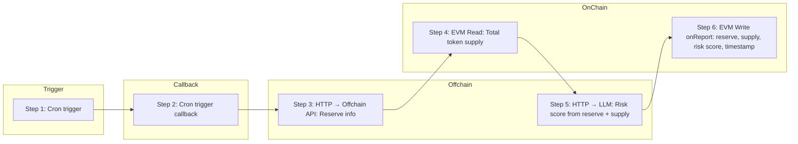
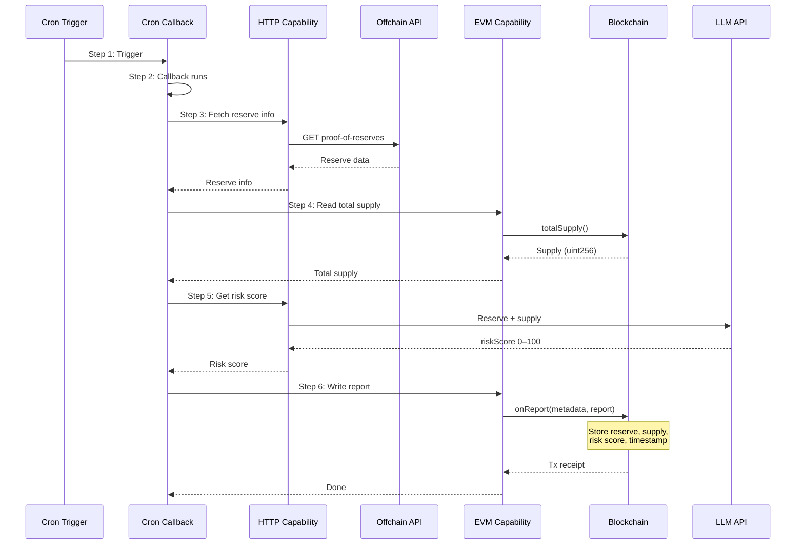

# Chapter 3: Building Blocks - The PoR x AI demo

Walking through the workflow, step by step!

## Starting Your CRE Project

### Clone this repo

```bash
git clone https://github.com/Nalon/cre-por-llm-demo.git
cd cre-por-llm-demo
bun install --cwd ./por
```

### Creating a New Workflow

When you start a new CRE project, you use the `cre init` command. For this workshop, we're working with an existing project, but let's understand what a fresh CRE project looks like:

```bash
cre init
cd my-project
bun install --cwd ./my-workflow
cre workflow simulate my-workflow
```

### Project Structure

After initialization, a CRE project has this structure:

```
my-project/
├── project.yaml                 # Project-level settings (RPCs, targets)
├── secrets.yaml                 # Secret variable mappings
└── my-workflow/                 # Your workflow directory
    ├── workflow.yaml            # Workflow-specific settings
    ├── main.ts                  # Workflow entry point
    ├── config.staging.json      # Workflow configuration for simulation
    ├── config.production.json   # Workflow configuration for production
    ├── package.json             # Node.js dependencies
    └── tsconfig.json            # TypeScript configuration
```

### Key Files Explained

**`project.yaml`** - Defines project-wide settings:

```yaml
staging-settings:
  rpcs:
    - chain-name: ethereum-testnet-sepolia
      url: https://ethereum-sepolia-rpc.publicnode.com
```

**`workflow.yaml`** - Maps targets to workflow files:

```yaml
staging-settings:
  user-workflow:
    workflow-name: "my-workflow"
  workflow-artifacts:
    workflow-path: "./main.ts"
    config-path: "./config.json"
    secrets-path: "../secrets.yaml"
```

**`config.staging.json`** - Your workflow's configuration, used for local simulations (loaded at runtime)

**`config.production.json`** - Your workflow's configuration, for production usage (loaded at runtime)

**`main.ts`** - Your workflow's entry point

### The Runner Pattern

All CRE workflows use the **Runner pattern** to initialize and run workflows. This connects the [trigger-and-callback model from Chapter 2](chapter-2-mental-model.md#the-trigger-and-callback-model):

```typescript
export async function main() {
  const runner = await Runner.newRunner<Config>();
  await runner.run(initWorkflow);
}
```

The `initWorkflow` function returns an array of handlers, each connecting a trigger to a callback using `cre.handler()`. This is the foundation of every CRE workflow.

## Step 0: Identify our expected capabilities

Let's orient ourselves by outlining our project to better understand the capabilities that we expect to use. For this project, we want to do the following:

- Update a PoR contract on some heartbeat/timer
- Call an offchain API to retrieve reserve information
- Read an on-chain contract to retrieve the total supply of a token
- Call an offchain API to ask an LLM for a risk score
- Write the results on-chain to update the PoR contract



With this, we know that we will be using the following capabilities:

- Cron trigger: To handle timed execution
- HTTP Capability: To call an off-chain API for reserve data
- EVM Read Capability: To read the on-chain supply of the token
- HTTP Capability: To call an off-chain API to ask an LLM for a risk score
- EVM Write Capability: To write the results on-chain to the PoR contract 




## Step 1: Setting up our trigger capability

We want our reserve contract to be updated on some heartbeat, which is the perfect use of the **Cron** trigger.


```typescript
const initWorkflow = (config: Config) => {
	const cronTrigger = new CronCapability()

	return [
		handler(
			cronTrigger.trigger({
				schedule: config.schedule,
			}),
			onCronTrigger,
		)
	]
}
```

We define the schedule for the task within the config file. See [config.staging.json](../por/config.staging.json).

```json
{
  "schedule": "0 0 0 * * *",
  "porUrl": "https://api.real-time-reserves.verinumus.io/v1/chainlink/proof-of-reserves/TrueUSD",
  "geminiModel": "gemini-2.5-flash",
  "evms": [
    {
      "tokenAddress": "0x41f77d6aa3F8C8113Bc95831490D5206c5d1cFeE",
      "porAddress": "0x93F212a3634D6259cF38cfad4AA4A3485C3d7D59",
      "chainSelectorName": "ethereum-testnet-sepolia",
      "gasLimit": "1000000"
    }
  ]
}
```

## Step 2: Creating the onCronTrigger callback function

This function will be called anytime the cron trigger is fired. To improve readability, I prefer to create helper functions that handle individual tasks within the callback. 

```typescript
const onCronTrigger = (runtime: Runtime<Config>, payload: CronPayload): string => {
	if (!payload.scheduledExecutionTime) {
		throw new Error('Scheduled execution time is required')
	}

	runtime.log('Running CronTrigger')

	const totalReserve = getOffChainReserves(runtime)
	const totalSupply = getOnChainSupply(runtime)
	const riskScore = getRiskScore(runtime, totalReserve, totalSupply)
	const txnHash = updateReserves(runtime, totalReserve,totalSupply, riskScore)

	runtime.log('Finished CronTrigger')

	return `${totalReserve} ${totalSupply} ${riskScore} ${txnHash}`
}

```

As the names suggest, they cover each step of our workflow that we defined above.


## Step 3: Retrieve the off-chain reserve values

Here, we'll be using the HTTP Capability to call some off-chain api. To do this, we'll use the recommended `sendRequest` pattern outlined within the [docs here](https://docs.chain.link/cre/guides/workflow/using-http-client/get-request-ts#1-the-sendrequest-pattern-recommended).

```typescript
const getOffChainReserves = (runtime: Runtime<Config>): bigint => {
	runtime.log(`fetching por url ${runtime.config.porUrl}`)

	const httpCapability = new HTTPClient()
	const reserveInfo = httpCapability
		.sendRequest(
			runtime,
			fetchReserveInfo,
			ConsensusAggregationByFields<ReserveInfo>({
				lastUpdated: median,
				totalReserve: median,
			}),
		)(runtime.config)
		.result()

	runtime.log(`ReserveInfo ${safeJsonStringify(reserveInfo)}`)

	const totalReserveScaled = BigInt(reserveInfo.totalReserve * 1e18)
	runtime.log(`TotalReserveScaled ${totalReserveScaled.toString()}`)

	return totalReserveScaled;
}`
```

The pattern involves two key components:

A Fetching Function: You create a function (e.g., fetchAndParse) that receives a sendRequester object and additional arguments (like config). This function contains your core logic—making the request, parsing the response, and returning a clean data object.

A Handler: You call httpClient.sendRequest(), which returns a function that you then call with your additional arguments. For a full list of supported consensus methods, see the [Consensus & Aggregation reference](https://docs.chain.link/cre/reference/sdk/consensus-ts).


The below fetching function will send the GET request to the defined `porURL` (within our config) and then return the values.

```typescript
const fetchReserveInfo = (sendRequester: HTTPSendRequester, config: Config): ReserveInfo => {
	const response = sendRequester.sendRequest({ method: 'GET', url: config.porUrl }).result()

	if (response.statusCode !== 200) {
		throw new Error(`HTTP request failed with status: ${response.statusCode}`)
	}

	const responseText = Buffer.from(response.body).toString('utf-8')
	const porResp: PORResponse = JSON.parse(responseText)

	if (porResp.ripcord) {
		throw new Error('ripcord is true')
	}

	return {
		lastUpdated: new Date(porResp.updatedAt),
		totalReserve: porResp.totalToken,
	}
}
```

## Step 4: Retrieve the on-chain total supply

Here, we'll be using the EVM Read capability to retrieve the total supply of some ERC20 token on-chain. Using the EVM Client and chain selectors, we can make calls to retrieve on-chain data from contracts. Note the use of a for loop over the `evmConfig` array. 

We mentioned earlier that a huge benefit of CRE is being able to interact with multiple networks through minimal changes to your workflow. This is one of those moments. By adding additional evm networks to the `evmConfig` array, we can effectively use the same workflow to sum the balance of a token that exists on multiple networks. You can apply this same logic in countless ways within your workflow.

```typescript

const getOnChainSupply = (runtime: Runtime<Config>): bigint => {
	const evms = runtime.config.evms
	let totalSupply = 0n

	for (const evmConfig of evms) {
		const network = getNetwork({
			chainFamily: 'evm',
			chainSelectorName: evmConfig.chainSelectorName,
			isTestnet: true,
		})

		if (!network) {
			throw new Error(`Network not found for chain selector name: ${evmConfig.chainSelectorName}`)
		}

		const evmClient = new EVMClient(network.chainSelector.selector)

		// Encode the contract call data for totalSupply
		const callData = encodeFunctionData({
			abi: IERC20,
			functionName: 'totalSupply',
			args: [],
		})

        //Call the contract through the EVM Client
		const contractCall = evmClient
			.callContract(runtime, {
				call: encodeCallMsg({
					from: zeroAddress,
					to: evmConfig.tokenAddress as Address,
					data: callData,
				})
			})
			.result()

		// Decode the result
		const supply = decodeFunctionResult({
			abi: IERC20,
			functionName: 'totalSupply',
			data: bytesToHex(contractCall.data),
		})

		totalSupply += supply
	}

	runtime.log(`TotalSupply ${totalSupply.toString()}`)
	return totalSupply
	

}
```


## Step 5: Retrieve the risk score from an LLM

Here, we'll use the HTTP capability to make a call to Gemini. We'll include a system and user prompt that requests a risk score to be returned for a given reserve value and total supply. This risk score will be an integer value between 0-100. We'll use the recommended `sendRequest` pattern that we saw previously.

```typescript
const getRiskScore = (runtime: Runtime<Config>, totalReserveScaled: bigint,totalSupply: bigint): bigint => {
	const httpCapability = new HTTPClient()
	const geminiApiKey = runtime.getSecret({ id: "GEMINI_API_KEY" }).result();

	const riskAnalysis = httpCapability
	.sendRequest(
		runtime,
		fetchRiskAnalysis(geminiApiKey.value, totalReserveScaled, totalSupply),
		ConsensusAggregationByFields<RiskAnalysis>({
			riskScore: median,
		}),
	)(runtime.config)
	.result()

	runtime.log(`RiskScore ${riskAnalysis.riskScore}`)
	
	return riskAnalysis.riskScore;
}
```

Note the use of secrets in the above function. Secrets are defined in the `secrets.yaml` file of your CRE project directory and are set within a `.env` file during local simulation. The steps to use secrets during deployment require them to be set through the CLI, see [here](https://docs.chain.link/cre/guides/workflow/secrets/using-secrets-deployed).

Secrets are accessed within your workflow through `runtime.getSecret`. You won't be able to access `runtime` within your fetching function, so we rely on a closure to access the secret.

```typescript
const fetchRiskAnalysis = 
(geminiApiKey: string, totalReserveScaled: bigint, totalSupply: bigint) => 
	(sendRequester: HTTPSendRequester, config: Config): RiskAnalysis => {

	const systemPrompt = `You are a risk analyst...`

	const userPrompt = `TotalSupply: ${totalSupply}
TotalReserveScaled: ${totalReserveScaled}
...`

    // Compose the structured instruction + content for deterministic JSON output
    // See https://ai.google.dev/gemini-api/docs/structured-output?example=recipe#rest_2
    const dataToSend = {
		system_instruction: { parts: [{ text: systemPrompt }] },
		contents: [
		  {
			parts: [
			  {
				text: userPrompt,
			  },
			],
		  },
		],
		generationConfig: {
			responseMimeType: "application/json",
			responseJsonSchema: {
				type: "object",
				properties: {
					riskScore: {
						type: "integer",
						description: "Risk score from 0 (lowest risk) to 100 (highest risk).",
						minimum: 0,
						maximum: 100,
					},
				},
				required: ["riskScore"],
			},
		},
	  };
  
	  // Encode request body as base64 (required by CRE HTTP capability)
	  const bodyBytes = new TextEncoder().encode(JSON.stringify(dataToSend));
	  const body = Buffer.from(bodyBytes).toString("base64");
  
	  const req = {
		url: `https://generativelanguage.googleapis.com/v1beta/models/${config.geminiModel}:generateContent`,
		method: "POST" as const,
		body,
		headers: {
		  "Content-Type": "application/json",
		  "x-goog-api-key": geminiApiKey,
		},
		cacheSettings: {
		  store: true,
		  maxAge: "60s",
		},
	  };
  
	  // Perform the request within CRE infra; result() yields the response
	  const resp = sendRequester.sendRequest(req).result();
	  const bodyText = new TextDecoder().decode(resp.body);
  
	  if (!ok(resp)) throw new Error(`HTTP request failed with status: ${resp.statusCode}. Error :${bodyText}`);
  
	  // Parse and extract the model text
	  const externalResp = JSON.parse(bodyText) as GeminiApiResponse;
  
	  const text = externalResp?.candidates?.[0]?.content?.parts?.[0]?.text;
	  if (!text) throw new Error("Malformed LLM response: missing candidates[0].content.parts[0].text");

	  const parsed = JSON.parse(text.trim()) as RiskAnalysis;
	  
	  return { riskScore: parsed.riskScore };
}
```

## Step 6: Update the on-chain PoR Contract

Here, we'll be using the EVM Write capability to store the values on-chain in our minimal reserve contract. As we did with the EVM Read capability, we make use of the EVM client.

To utilize the EVM write capability we:

1. Encode our report values
2. Generate a report
3. Write that report on-chain

```typescript

const updateReserves = (
	runtime: Runtime<Config>,
	totalReserveScaled: bigint,
	totalSupply: bigint,
	riskScore: bigint,
): string => {
	const evmConfig = runtime.config.evms[0]
	const network = getNetwork({
		chainFamily: 'evm',
		chainSelectorName: evmConfig.chainSelectorName,
		isTestnet: true,
	})

	if (!network) {
		throw new Error(`Network not found for chain selector name: ${evmConfig.chainSelectorName}`)
	}

	const evmClient = new EVMClient(network.chainSelector.selector)

	runtime.log(
		`Updating reserves totalSupply ${totalSupply.toString()} totalReserveScaled ${totalReserveScaled.toString()}`,
	)

	  // Encode alert data as ABI parameters
	  const reportData = encodeAbiParameters(
		parseAbiParameters(
		  "uint256 totalMinted, uint256 totalReserve, uint256 riskScore"
		),
		[totalSupply, totalReserveScaled, riskScore]
	  );

	// Step 1: Generate report using consensus capability
	const reportResponse = runtime
		.report({
			encodedPayload: hexToBase64(reportData),
			encoderName: 'evm',
			signingAlgo: 'ecdsa',
			hashingAlgo: 'keccak256',
		})
		.result()

	const resp = evmClient
		.writeReport(runtime, {
			receiver: evmConfig.porAddress,
			report: reportResponse,
			gasConfig: {
				gasLimit: evmConfig.gasLimit,
			},
		})
		.result()

	const txStatus = resp.txStatus

	if (txStatus !== TxStatus.SUCCESS) {
		throw new Error(`Failed to write report: ${resp.errorMessage || txStatus}`)
	}

	const txHash = resp.txHash || new Uint8Array(32)

	runtime.log(`Write report transaction succeeded at txHash: ${bytesToHex(txHash)}`)

	return bytesToHex(txHash)
}
```

EVM Writes utilize reports that are processed on-chain by a forwarder contract and then passed to your destination contract. The EVM Write capability does not write directly to your contract. When looking for your transactions on an explorer, this generally means they won't appear unless you are looking at internal transactions. Additionally, EVM Writes stemming from local simulation come from your private key designated within your `.env` file. In production, the writes will be sent from the EVM DON.
 
Note that forwarding addresses differ between Mainnet, Testnet, and local simulation. See the [docs here](https://docs.chain.link/cre/guides/workflow/using-evm-client/forwarder-directory-ts#overview) for more information. It is worth noting that metadata values are not included by the forwarder during local simulation.

Contracts that you wish to write to must implement the [ReceiverTemplate](../contracts/interfaces/ReceiverTemplate.sol) and override `_processReport`.

```solidity
// SPDX-License-Identifier: MIT
pragma solidity ^0.8.19;

import { ReceiverTemplate } from "./interfaces/ReceiverTemplate.sol";

contract ReserveManager is ReceiverTemplate{

    uint256 public lastTotalMinted;
    uint256 public lastTotalReserve;
    uint256 public lastRiskScore;
    uint256 public lastUpdatedAt;
    uint256 private requestIdCounter;

    constructor(address forwarderAddress) ReceiverTemplate(forwarderAddress) {}

    function updateReserves(uint256 totalMinted, uint256 totalReserve, uint256 riskScore) private {
        lastTotalMinted = totalMinted;
        lastTotalReserve = totalReserve;
        lastRiskScore = riskScore;
        lastUpdatedAt = block.timestamp;
        requestIdCounter++;
    }

    function _processReport(bytes calldata report) internal override {
        (uint256 totalMinted, uint256 totalReserve, uint256 riskScore) = abi.decode(report, (uint256, uint256, uint256));

        updateReserves(totalMinted, totalReserve, riskScore);
    }

}
```

### Testing the workflow


## Setup `.env` values for local testing

```bash
cp .env.sample .env
```

Within the new `.env` file, set your private key and gemini api key accordingly.

```yaml
###############################################################################
### REQUIRED ENVIRONMENT VARIABLES - SENSITIVE INFORMATION                  ###
### DO NOT STORE RAW SECRETS HERE IN PLAINTEXT IF AVOIDABLE                 ###
### DO NOT UPLOAD OR SHARE THIS FILE UNDER ANY CIRCUMSTANCES                ###
###############################################################################
# Ethereum private key or 1Password reference (e.g. op://vault/item/field)
CRE_ETH_PRIVATE_KEY=your-eth-private-key
# Default target used when --target flag is not specified (e.g. staging-settings, production-settings, my-target)
CRE_TARGET=staging-settings
# Gemini configuration: API Key
GEMINI_API_KEY_VAR=your-gemini-api-key
```

## Simulate the workflow

Simulate the workflow without the EVM write capability resulting in a real transaction:

```bash
cre workflow simulate por
```

Simulate the workflow with the EVM write capability sending a real transaction:
```bash
cre workflow simulate por --broadcast
```

You should see:

```
Workflow Simulation Result:
 "494515082750000009035382784 1000000000000000000000000 59 0x69c3e7b19c0733d1ca77dec4444467cce182e4c4d0a03113e367c8836c82446a"
```

# Important Callouts

- Complete CRE docs (TXT) [available](https://docs.chain.link/cre/llms-full-ts.txt)! 
- [Chainlink MCP Server](https://www.npmjs.com/package/@chainlink/mcp-server)
- [CRE GCP Prediction Market Demo](https://github.com/smartcontractkit/cre-gcp-prediction-market-demo)
- [CRE x402 Price Alert Demo](https://github.com/smartcontractkit/x402-cre-price-alerts)